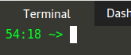

## Kubernetes 102, Section 3: Creating the YML File

---

**WARNING - YOU HAVE LESS THAN 1 HOUR BEFORE YOUR SESSION EXPIRES!**

>Note the time left (in HH:MM) for the session, it is in your prompt and updated after every command run:

## Basic Overview of YML files and Kubernetes

YML files are very particular about spacing. Always use the space bar to indent and never use TAB. Below is an example of a YAML file. 

We are going to create a Deployment for our Kubernetes cluster. 
A Deployment creates Pods and defines which container image(s) to use, how many replicas of the Pod the container is deployed into to maintain, and configuration options for the Pod. 
Kubernetes will maintain the health of the Pods deployed from the Deployment until the Deployment is deleted. 
That means that if you manually delete a Pod that is tied to a Deployment, Kubernetes will immediately redeploy a new pod. 

---

## Namespace Creation

To create your own namespace (for example, sandbox), select the commands below, if not, skip this step:

In this example, we are going to deploy in the default namespace. Namespaces are a Kubernetes logical construct used for separating Objects. If you are deploying this on a local cluster, you can create a sandbox namespace using the command kubectl create ns sandbox. 

Step 1:
`kubectl create ns sandbox
`{{execute}}

“namespace/sandbox created” will be displayed

**Note, this is NOT a mandatory step.

The command below will list the current namespaces in a cluster. 

Step 2:
`kubectl get namespace
`{{execute}}
