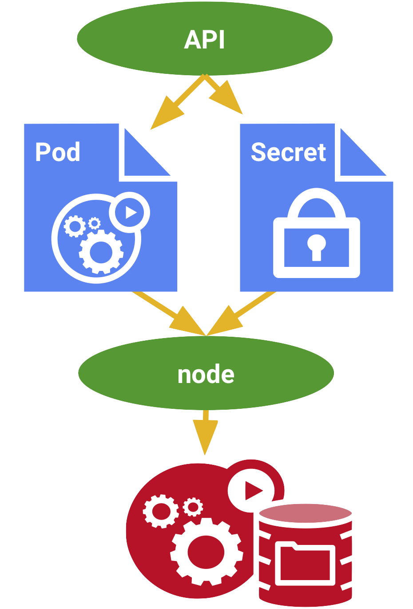

## Kubernetes 105, Section 2: Creating Secrets 

---

**WARNING - YOU HAVE LESS THAN 1 HOUR BEFORE YOUR SESSION EXPIRES!**

>Note the time left (in HH:MM) for the session, it is in your prompt and updated after every command run:

---

## Overview of Secrets 

Kubernetes Secrets let you store and manage sensitive information, such as passwords, OAuth tokens, and ssh keys. Storing confidential information in a Secret is safer and more flexible than putting it verbatim in a Pod definition or in a container image. See Secrets design document for more information.

A Secret is an object that contains a small amount of sensitive data such as a password, a token, or a key. Such information might otherwise be put in a Pod specification or in an image. Users can create Secrets and the system also creates some Secrets.

---

## Encoding Secrets

In this scenario, we're going to be encoding the username and password of the secret.yml file. 

By default, Kubernetes requires data stored in Secrets to be base64 encoded. The base64 command encodes and decodes data, which is what we're going to be using it for in this scenario.  

Step 1:
Display the contents of secret.yml. 
`cat secret.yml
`{{execute}}

Step 2:
Ecnode the username:
`echo -n 'admin' | base64
`{{execute}}

Step 3:
Encode the password:
`echo -n 'password' | base64
`{{execute}}

Step 4:
Apply the Secrets:
`kubectl apply -f secret.yml
`{{execute}}

## Decoding Secrets

Step 1:
Decode the username:
`echo -n 'YWRtaW4=' | base64 -d
`{{execute}}

Step 2:
Decode the password:
`echo -n 'cGFzc3dvcmQ=' | base64 -d
`{{execute}}
