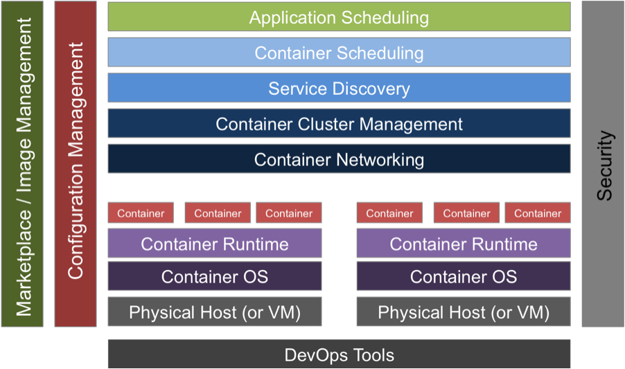

## Question (1/10)

Note: All questions are mandatory. Once completed, click on the 'Check Answers' button to validate and continue to the next question.

---

## Containers 101

The traditional way of hosting applications and services is on a virtual machine. One drawback to hosting an application on a virtual machine is the resource overhead, as each application would require an entire base operating system plus all the packages and dependencies required to run. The base OS and the packages installed on top of that OS will also require attention and maintenance. OS patches will need to be installed, configuration files set and maintained, the correct dependencies and libraries installed, etc, etc. Containers solve this resource dilemma and maintenance overhead by packing all application source code, dependencies, and even a shrunken down base OS image (typically Alpine Linux) into one portable image that will be able to run on a host with a container runtime. The most common container runtime (or container engine), which you have most likely heard of, is Docker.

---

>>Q1: List the two types of overhead necessary for hosting applications on virtual machines.<< 
=~= resource and maintenance overhead

>>Q1: The type of overhead that utilizes an entire operating system, packages, and dependencies is...<< 
=~= resource overhead

