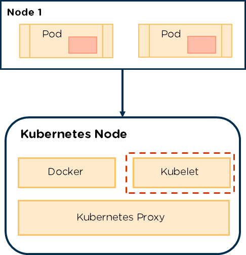

## Question (3/10)

Note: All questions are mandatory. Once completed, click on the 'Check Answers' button to validate and continue to the next question.

---

As mentioned, your application is deployed on a Worker Node within a K8s cluster. Kubelet is a process that exists on each Worker Node that listens to the API Server for Pods to be scheduled. A Worker Node can have any given number of Pods scheduled on it, which are scheduled by the API server. The Kubelet can also monitor the health of each Pod on the Node it resides on.

---

>>Q3: A Worker Node's Pods are scheduled by the... ?<< 
(*) API server
() controller manager
() engine-eh-ks
