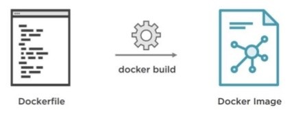

## Question (2/10)

Note: All questions are mandatory. Once completed, click on the 'Check Answers' button to validate and continue to the next question.

## Docker Containers

When a container is built, the base OS version, dependencies, source code, and configurations are all declared in what is called the Dockerfile. On build, Docker references the Dockerfile and builds the image from scratch per the specification of the file. This means that if you ever need to change or add a dependency, you simply edit the Dockerfile and rebuild the image. Building an image is a process that typically takes less than a minute. This allows you to have an entire application ready for deployment and deployed within minutes, compared to the days that it could potentially take to get a VM provisioned and the proper dependencies installed and configured properly. Developers write the Dockerfiles for their application once they are ready to deploy it. This eliminates the need for the developers to have to rely on Infrastructure Admins to get their application properly running on a VM with the right dependencies and configurations set. In short, containers are easier to deploy and have a lot less overhead than virtual machines.

---

Think of a Docker host as a hypervisor for Docker containers. With Docker installed, you capable of running as many containers as your computing resources will allow. If virtual machines are about sharing the same hardware, then containers are about sharing the same OS kernel. A Docker host resides one specialized VM (typically Moby Linux) that is designed for hosting containers. Each container that is deployed on that specific host will share that VM's kernel.

---
>>Q2: Whenever changing or adding a dependency, you just need to... << 
() Update the container
() Build a new pod
(*) Edit the Dockerfile and rebuild the image
