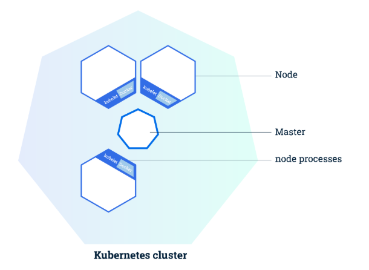

## Question (9/10)

Note: All questions are mandatory. Once completed, click on the 'Check Answers' button to validate and continue to the next question.

---

## Kubernetes Master
The Kubernetes Master is a collection of processes that are responsible for scheduling all tasks within the Kubernetes environment and maintaining the cluster's desired state. Each command you send via kubectl is sent to the master. The Master (AKA the "brain" of Kubernetes) can also reside on its own reserved Node. The Master is responsible for maintaining the state of objects within the cluster. If a Pod crashes, the Master will kill the Pod and deploy a new one immediately. Since a Pod is comprised of containers, they can be rapidly deployed, reconfigured and redeployed. If the Pods that make up an application that is deployed in Kubernetes are out of date or need to be changed, they will be replaced with new Pods that contain the new revisions. 

---

>>Q9: The Master is responsible for maintaining the state of objects within the cluster. << 
(*) True
() False
